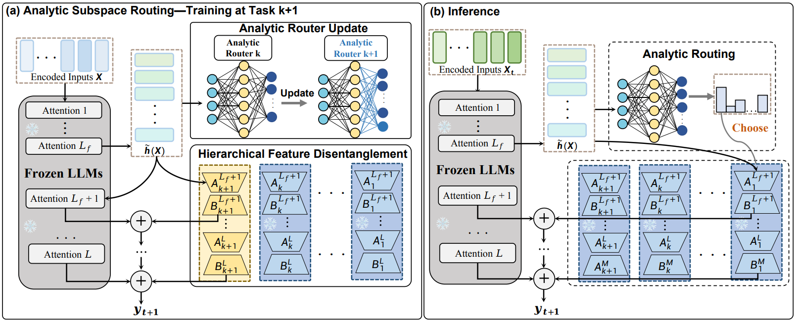
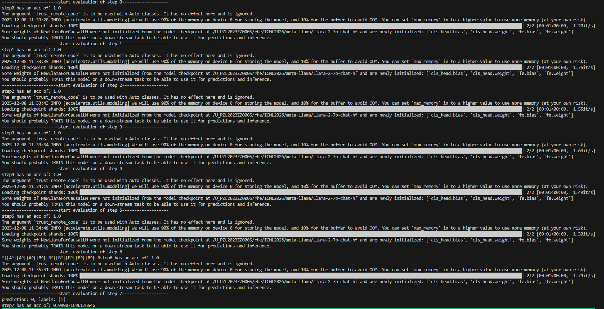
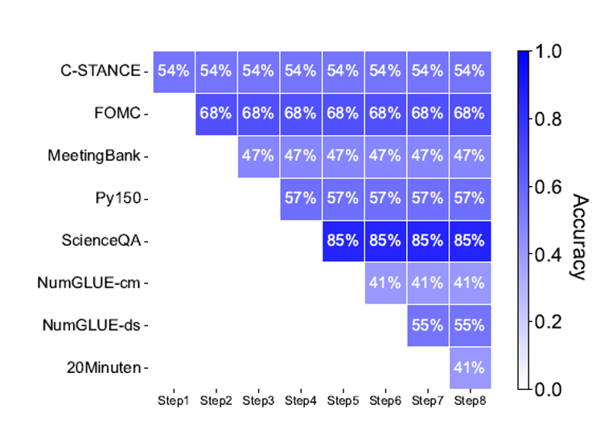

# 【ICCV' 2025】Any-SSR: How Recursive Least Squares Works in Continual Learning of Large Language Model
###  Kai Tong, Kang Pan, Xiao Zhang, Erli Meng, Run He, Yawen Cui, Nuoyan Guo, Huiping Zhuang* 

## Introduction
This is the official implementation for Any-SSR [Any-SSR: How Recursive Least Squares Works in Continual Learning of Large Language Model](https://openaccess.thecvf.com/content/ICCV2025/html/Tong_Any-SSR_How_Recursive_Least_Squares_Works_in_Continual_Learning_of_ICCV_2025_paper.html).

## Overview

<div align="center">

</div>

## Environment
We recommend using the [Anaconda](https://anaconda.org/) to install the development environment.

```bash
git clone --depth=1 https://github.com/ZHUANGHP/Any-SSR.git

cd Any-SSR
conda env create -f environment.yaml

```
## Quick Start
All the data after processing can be downloaded from [Trace Benchmark](https://drive.google.com/file/d/1S0SmU0WEw5okW_XvP2Ns0URflNzZq6sV/view)

You should specify the directory to the dataset and the pretrained model (we used [Llama-2-7b-chat-hf](https://huggingface.co/meta-llama/Llama-2-7b-chat-hf)). You can download the pre-trained weight via the code or directly download it from huggingface. 

After finishing dataset and pre-trained weight downloading, use
```bash
python train_router_ana_continual.py
```
to train the router weight recursively, then use
```bash

python eval_router_ana.py
```
to generate routing accuracy.

<div align="center">

</div>

The router can have nearly 100 percent accuracy in the experiments.

### Lora Model Training

You can use
```bash
bash train_lora.sh
```
to train a lora model for each task in the Trace dataset. 

### Evaluate
```bash
bash scripts/inference.sh
```
This commend will start the inference. Before inference, please specify the directories to the lora models, router weights and other in the script. 

<div align="center">

</div>


## From new branch called Analytic Continual Learning
This is the first LLM member from the continual learning branch: [Analytic Continual Learning](https://github.com/ZHUANGHP/Analytic-continual-learning). We have published over 20 papers in this branch (check [My Scholar](https://scholar.google.com.sg/citations?user=vCXxuLkAAAAJ&hl=en))!

## Cite our paper
If you find our paper or this repository useful, please kindly consider citing our paper.

```bib
@InProceedings{Tong_2025_ICCV,
    author    = {Tong, Kai and Pan, Kang and Zhang, Xiao and Meng, Erli and He, Run and Cui, Yawen and Guo, Nuoyan and Zhuang, Huiping},
    title     = {Any-SSR: How Recursive Least Squares Works in Continual Learning of Large Language Model},
    booktitle = {Proceedings of the IEEE/CVF International Conference on Computer Vision (ICCV)},
    month     = {October},
    year      = {2025},
    pages     = {3047-3057}
}
```