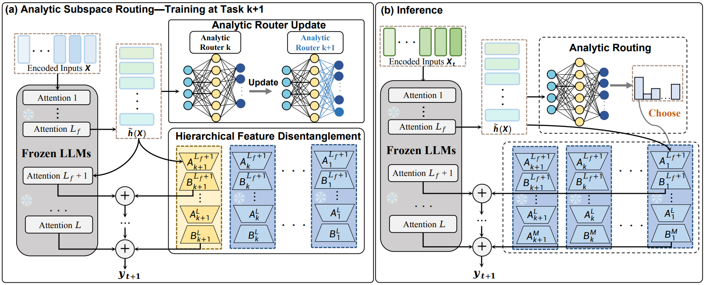
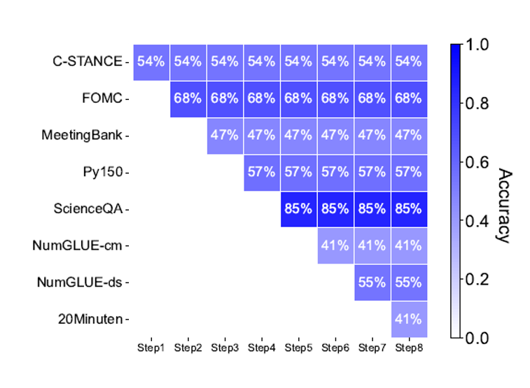

# 【ICCV' 2025】Any-SSR: How Recursive Least Squares Works in Continual Learning of Large Language Model
###  Kai Tong, Kang Pan, Xiao Zhang, Erli Meng, Run He, Yawen Cui, Nuoyan Guo, Huiping Zhuang* 

## Introduction
This is the official implementation for Any-SSR [Any-SSR: How Recursive Least Squares Works in Continual Learning of Large Language Model](https://openaccess.thecvf.com/content/ICCV2025/html/Tong_Any-SSR_How_Recursive_Least_Squares_Works_in_Continual_Learning_of_ICCV_2025_paper.html).

## Overview

<div align="center">

</div>

## Setup and run

Linux, Conda, and an NVIDIA GPU are recommended.

```bash
cd Any-SSR

conda create -n anyssr python=3.11 -y
conda activate anyssr
pip install -r requirements.txt

pip uninstall torch -y
pip install torch --index-url https://download.pytorch.org/whl/cu128
FLASH_ATTENTION_SKIP_CUDA_BUILD=TRUE \
  pip install flash-attn==2.7.2.post1 --no-build-isolation
```

Run all five CodeTask O-LoRA permutations:

```bash
bash scripts/train_O_LoRA_permutation.sh
```

The experiments run sequentially. Checkpoints are saved in
`output_models/OLoRA_Qwen2.5-Coder-1.5B_permutation_1` through
`output_models/OLoRA_Qwen2.5-Coder-1.5B_permutation_5`.


<div align="center">

</div>


## From new branch called Analytic Continual Learning
This is the first LLM member from the continual learning branch: [Analytic Continual Learning](https://github.com/ZHUANGHP/Analytic-continual-learning). We have published over 20 papers in this branch (check [My Scholar](https://scholar.google.com.sg/citations?user=vCXxuLkAAAAJ&hl=en))!

## Cite our paper
If you find our paper or this repository useful, please kindly consider citing our paper.

```bib
@InProceedings{Tong_2025_ICCV,
    author    = {Tong, Kai and Pan, Kang and Zhang, Xiao and Meng, Erli and He, Run and Cui, Yawen and Guo, Nuoyan and Zhuang, Huiping},
    title     = {Any-SSR: How Recursive Least Squares Works in Continual Learning of Large Language Model},
    booktitle = {Proceedings of the IEEE/CVF International Conference on Computer Vision (ICCV)},
    month     = {October},
    year      = {2025},
    pages     = {3047-3057}
}
```
